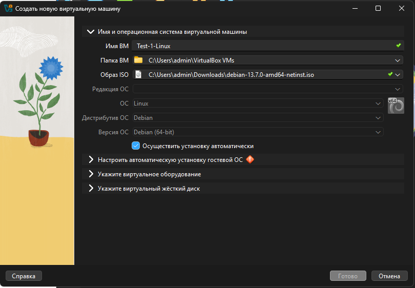
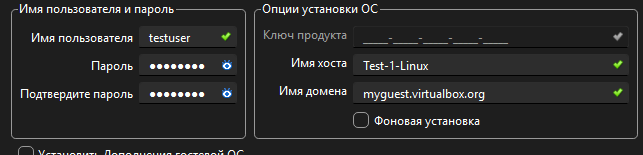
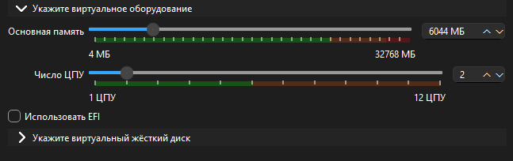
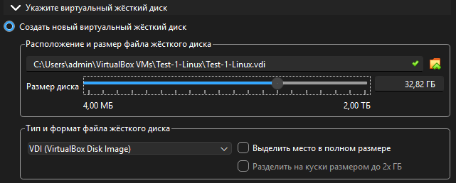

1.) Разворачиваем виртуальную машину через VirtualBox. В качестве ОС используется Debian.
Образ взят от сюда https://www.debian.org/download.ru.html

Создана новая виртуальная машина и указаны основные параметры:

