## Удалённый доступ
### Настройка SSH

 Проверяем имеется ли на VM служба ssh
   `systemctl status ssh`
Если службы нет - устанавливаем :
`apt install openssh-server`
Возможно необходимо перед этим будет обновить пакеты
`apt update`

### Настройка сети для доступа к VM1

Изначально VM1 недоступна напрямую с хостовой системы. Для того чтобы она стала доступной необходимо в настройках VirtualBox  добавить дополнительный второй  адаптер Host-only:

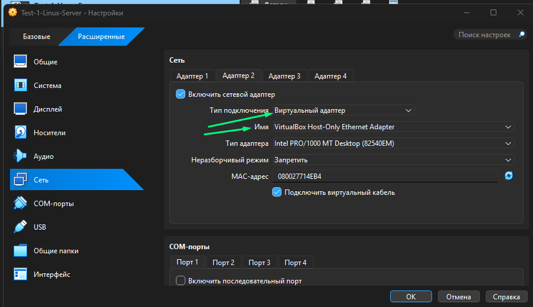

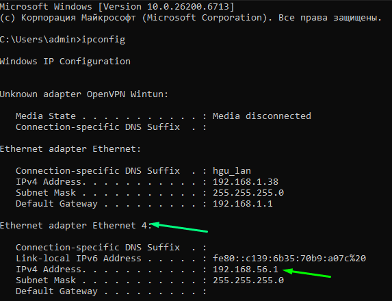

После загрузки VM1 проверяем сетевые интерфейсы: :
```
ip -br a
```


Интерфейс enp0s8 появился, но IP-адрес ему ещё не назначен.
Прописываем ему сеть :
```
 /etc/network/interfaces
```
Для Host-Only интерфейса задаём статический адрес:

```
auto enp0s8
iface enp0s8 inet static
    address 192.168.56.10/24
```

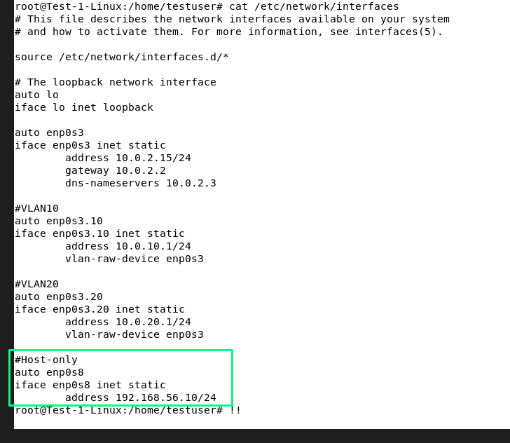

И перезапускаем виртуальную машину, проверяем командой ip -br a интерфейсы и проверяем доступность хостовой системы с vm1 

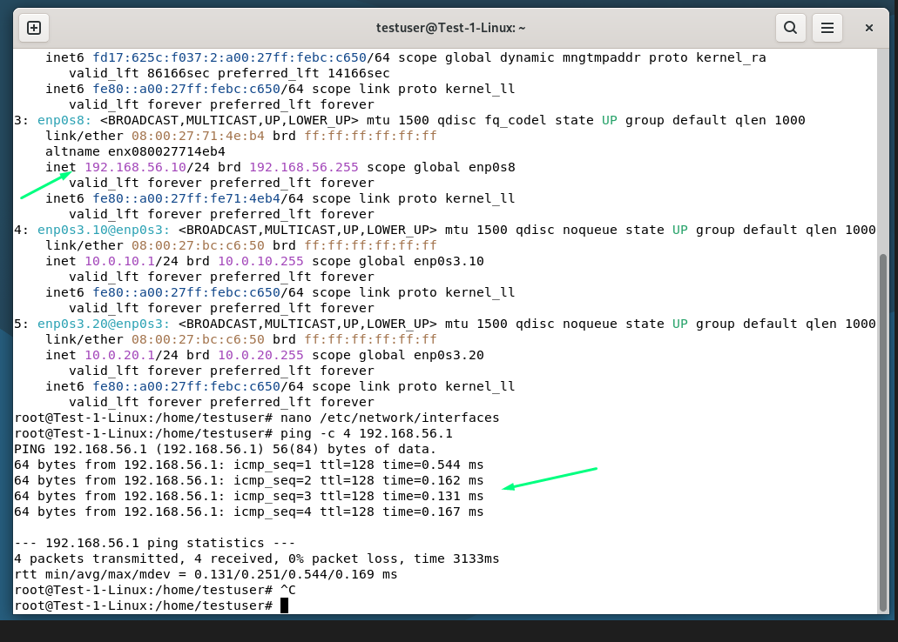

Так же проверим с хоста пинг vm1


### Настройка VM2

Запускаем чистую вторую виртуальную машину с debian, заранее указав у нее второй адаптер host-only
проверяем интерфейсы, видим, что по ней мы получили ip-adress автоматически 

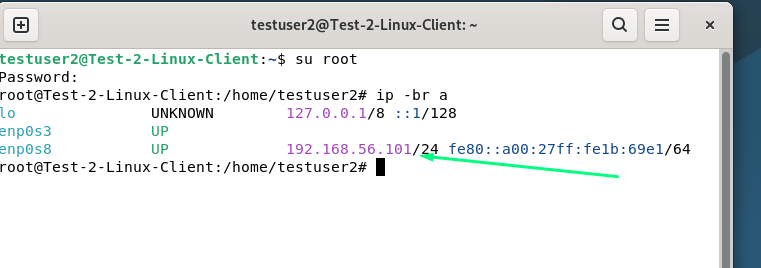

Настроим сеть следующим образом :
Для enp0s3 мы проставим dhcp - для доступа в интернет
Для enp0s8 мы проставим для удобства статику 192.168.56.20

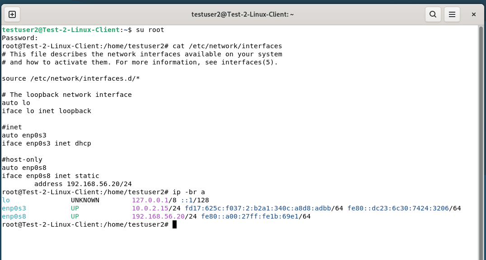


В результате:
VM1 - 192.168.56.10
VM2 - 192.168.56.20

VM2 будет использоваться как клиент для подключения к VM1 по SSH.

### SSH-аутентификация по ключу

Создаем ssh-ключ. Он создается на vm2

```
ssh-keygen -t ed25519
```

В качестве расположения ключа оставляем путь по умолчанию.
Второе - это пароль для ключа - указываем пароль

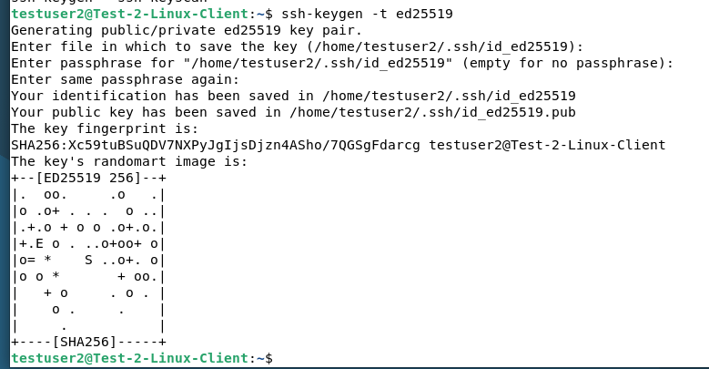

Создается два ключа публичный и приватный. Приватный остается у нас. А публичный копируем на VM1
командой : 
```
ssh-copy-id testuser@192.168.56.10
```

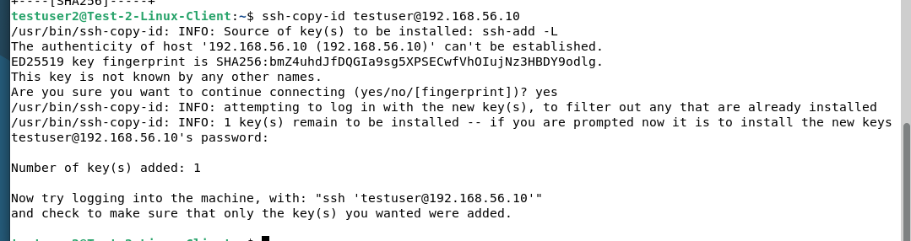

Пробуем подключиться :
Запрашивает пароль именно от приватного ключа, а не пароль учётной записи VM1

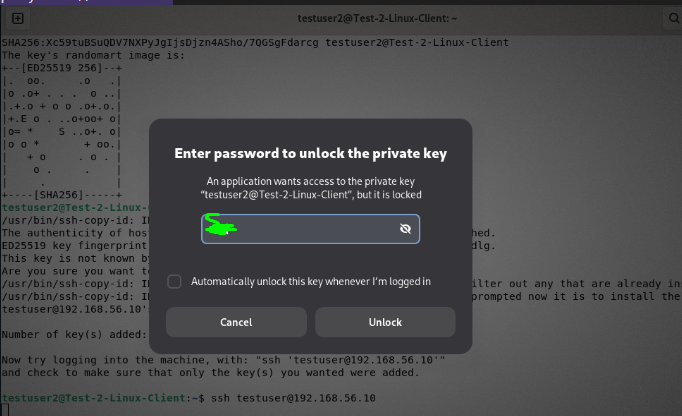

В итоге мы подключились по ssh ключу с VM2 в VM1

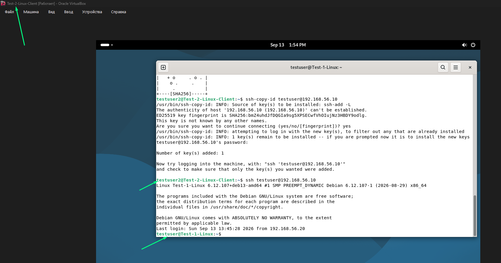

Но на практике каждый сотрудник должен подключаться под своими учетными записями.

Поэтому для примера сделаем учетные записи Иванова и Ахметова на двух VM
```
adduser ivanov
adduser akhmetov
```


Теперь на VM2 создаем ключи (в этот раз не будем указывать пароль для ключа, но так делать нельзя) с которого будем подключаться к VM1

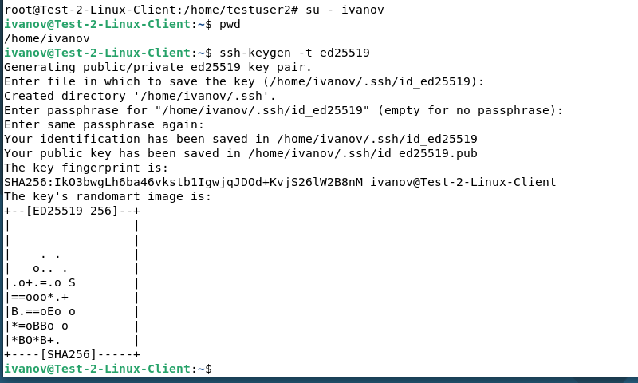

И передаем публичный ключ 

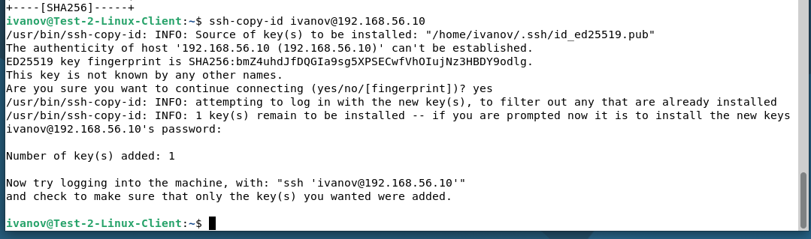

Тоже самое делаем для второго пользователя :

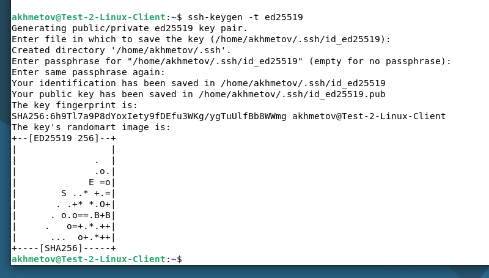

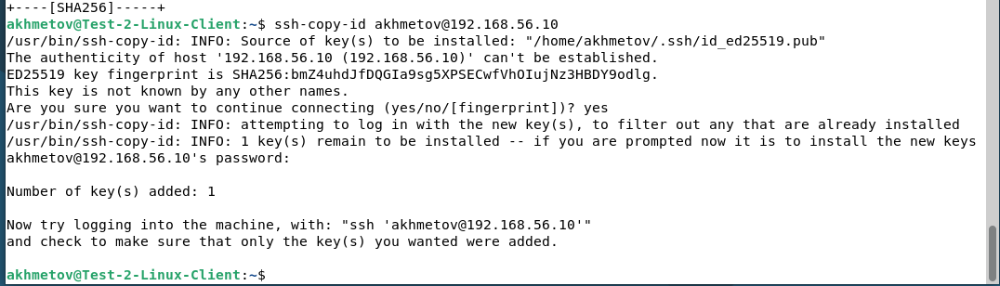

Делается это все для того чтобы при необходимости мы могли легко с vm1 удалить публичные ключи - например, если сотрудник уволится. 

Как видно из скриншота у сотрудник Иванов не может даже зайти в директорию Ахметова - тем самым он не сможет "случайно" скопировать или отредактировать публичный и приватный ключ другого сотрудника :

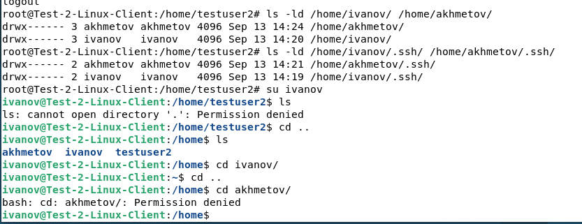

### Подключение с Windows через PuTTY
Чтобы подключиться с хоста windows используем программу putty, но для начала необходимо на хосте создать ключи - для этого используется встроенная утилита у putty - PuTTYgen

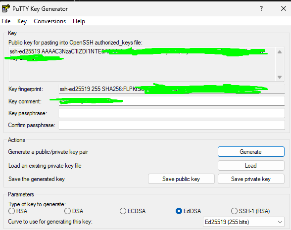

Копируем публичный ключ и вставляем второй строкой в /home/testuser/.ssh/authorized_keys

Для загрузки приватного ключа в память можно использовать Pageant

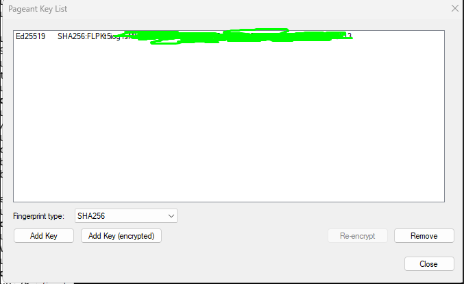

Теперь пробуем подключиться к VM1 через puttu :

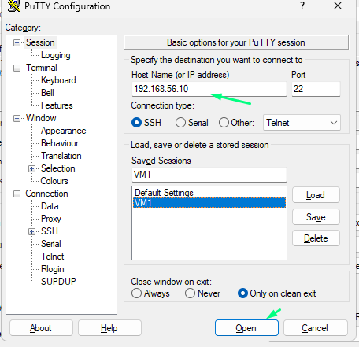

Вводим логин и сразу же подключаемся к VM1

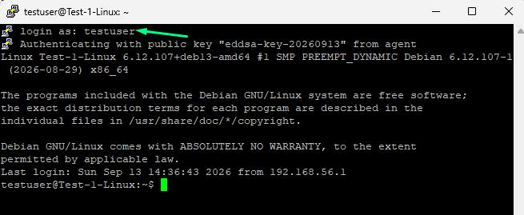

## Усиление безопасности SSH

Теперь мы закрываем доступ по паролю на VM1

Редактируем данный файл :
```
/etc/ssh/sshd_config
```
Устанавливаем следующие параметры:

```
Port 2222 
PermitRootLogin no 
PubkeyAuthentication yes 
PasswordAuthentication no 
KbdInteractiveAuthentication no
```

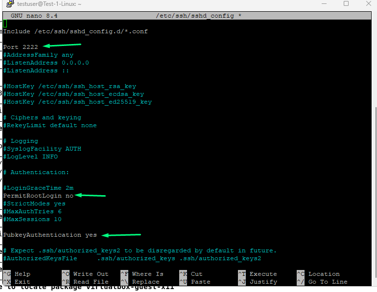

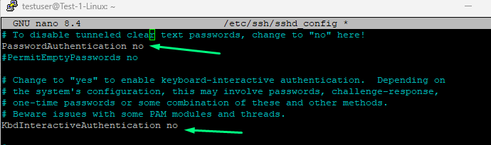

Перед перезапуском ssh желательно проверить синтаксис :
```
sshd -t
```

После чего перезапускаем службу
````
systemctl restart ssh
````

#  Настройка VPN WireGuard
Устанавливаем WireGuard на VM1 (server)
```
apt install wireguard
```
Создаем приватный ключ и из него получаем публичный
```
wg genkey > server_private.key
wg pubkey < server_private.key > server_public.key
```

Аналогично повторяем на VM2 (client)

### Конфигурация VM1 : 
```
nano /etc/wireguard/wg0.conf 
chmod 600 /etc/wireguard/wg0.conf
```
VM1 - сервер 
Address = адрес VM1 внутри VPN
ListenPort  = udp-порт, по которому впн принимает подключения
PrivateKey = Приватный  ключ VM1

PublicKey= публичный  ключ VM2
AllowedIPs =PN-адрес, разрешённый для данного peer

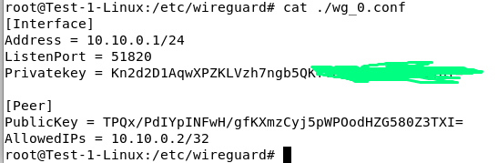

### Конфигурация VM2
```
nano /etc/wireguard/wg0.conf
chmod 600 /etc/wireguard/wg0.conf
```
Address = адрес VM2 внутри VPN
PrivateKey = Приватный ключ VM2

PublicKey= публичный  ключ VM1
Endpoint = реальный адрес по какому доступен сервис впн
AllowedIPs = какие адреса необходимо направлять через VPN
PersistentKeepalive = периодически поддерживать соединение активным

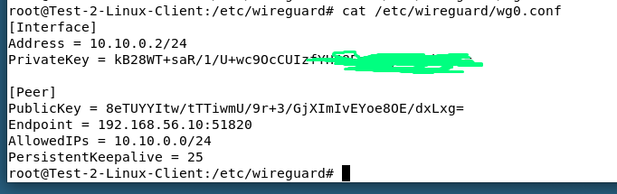

### Запуск WireGuard
Теперь на нашем сервере VM1  поднимаем впн командой 
```
wg-quick up wg0
```

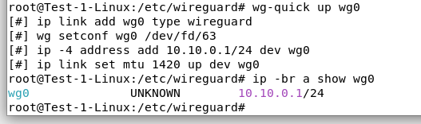

Аналогично делаем и на VM2 

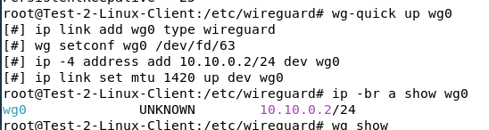

Проверяем ping

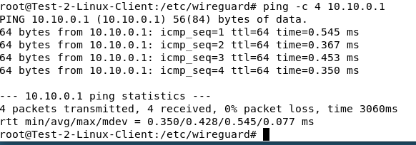

Осталось службу поставить на автозапуск :
```
systemctl enable wg-quick@wg0
```
